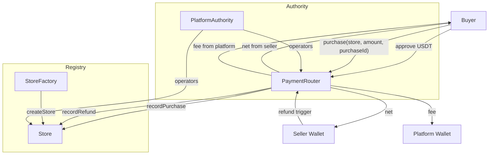
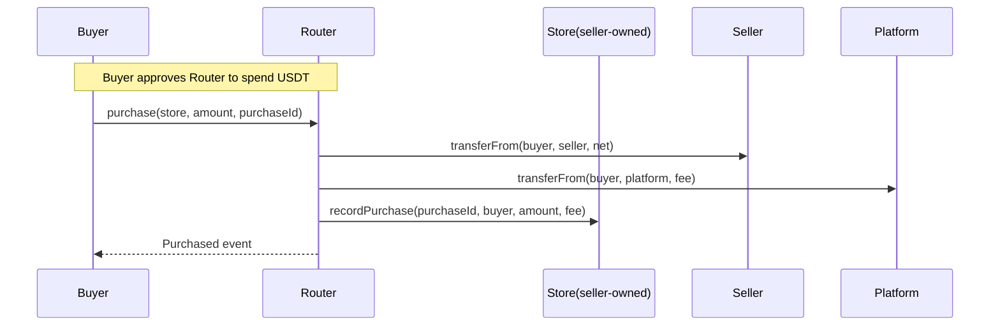
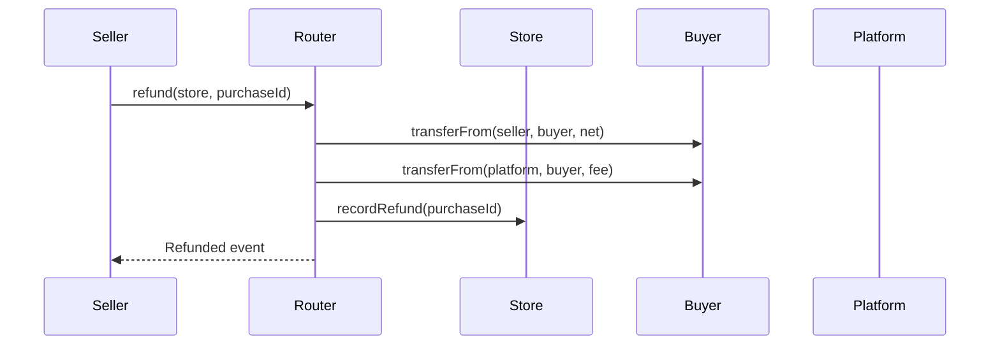

# Goowoo Pay Smart Contracts (Kaia)

[🇺🇸 English](#english) | [🇰🇷 한국어](#한국어)

---


# 🇺🇸 English

Goowoo Pay smart contracts running on Kaia mainnet. Instant settlement (P2P) model where payments are directly transferred from buyer to seller/platform without custody.

### Table of Contents

- [Overview](#overview)
- [Store Creation](#store-creation)
- [Deployment Addresses](#deployment-addresses)
- [Architecture](#architecture)
- [Contract Descriptions](#contract-descriptions)
- [Installation/Environment Variables](#installationenvironment-variables)
- [Compile/Deploy/Verify](#compiledeployverify)
- [Testing](#testing)
- [Allowance Checklist](#allowance-checklist)
- [Usage Examples](#usage-examples)
- [API Reference](#api-reference)
- [Troubleshooting](#troubleshooting)
- [Tech Stack](#tech-stack)
- [Security/Operations](#securityoperations)

## Overview

- Token: Native USDT (Kaia)
- Store Creation: Individual stores created per seller via StoreFactory 
- Payment Flow: Buyer approves USDT to Router → Router distributes to seller/platform → Store records
- Refund Flow: Pull-refund from seller wallet (net) and platform wallet (fee) to buyer (full refund policy)
- Global/Store-specific pause: Router (global), Store (individual)
- Authority Management: Platform operator management through PlatformAuthority

## Store Creation

### 1. Creating Store via StoreFactory
```js
// Create new store through StoreFactory contract
const factory = await ethers.getContractAt("StoreFactory", factoryAddress);
const tx = await factory.createStore(sellerAddress, initialFeeBps);
const receipt = await tx.wait();

// Extract created store address
const storeAddress = receipt.events.find(e => e.event === "StoreCreated").args.store;
```

### 2. Store Configuration After Creation
```js
// Created store contract instance
const store = await ethers.getContractAt("Store", storeAddress);

// Check store information
const owner = await store.owner(); // Seller address
const feeBps = await store.feeBps(); // Fee rate (default: 100 = 1%)
const router = await store.router(); // PaymentRouter address
```

### 3. Store Management Features
- **Fee Change**: Only platform operators (`setFeeBps`)
- **Router Change**: Only platform operators (`setRouter`)
- **Pause**: Seller or platform operator (`pause`/`unpause`)

## Deployment Addresses

- PlatformAuthority: `0xe696Fcd2661C9C3Cf7898b7b5ABbA36f3ff1f10e`
- PaymentRouter: `0xa33acA5a4135a9eDfc39BC76c4E9d5DF78c47299`
- StoreFactory: `0x78351dEF0790cCAf430C02382625dE4F318d9170`

Explorer: [Kaiascan](https://kaiascan.io/)  ·  RPC: `https://public-en.node.kaia.io`

## Architecture



### Purchase Flow (Detailed)



### Refund Flow (Full Refund)



## Contract Descriptions

### PlatformAuthority.sol
- Owner registers/unregisters platform operators
- Functions: `addOperator(address)`, `removeOperator(address)`, `isOperator(address) -> bool`

### Store.sol (Owner=Seller)
- State: `platformAuthority`, `router`, `feeBps`, `PurchaseRecord`
- Only platform operators can `setFeeBps(uint16)`, `setRouter(address)`
- Records: `recordPurchase`, `recordRefund` (Router only)
- Pause: Seller or platform operator
- Queries: `getPurchase(purchaseId)`, `getPurchaseFields(..)`

### StoreFactory.sol
- Deploy stores with `createStore(seller, initialFeeBps)` (Router address injected at creation)
- Registry: `getStoresBySeller(seller)`, `isStore(store)`, `storeToSeller(store)`
- Management: `setRouter(address)`

### PaymentRouter.sol
- Immutable: `usdt`
- Configuration: `platformWallet`, `factory`
- Global pause: `pause()/unpause()` (platformWallet)
- Purchase: `purchase(store, amount, purchaseId)`
- Refund (full): `refund(store, purchaseId)` (seller only)
- Events: `Purchased`, `Refunded`, `PlatformWalletUpdated`, `FactoryUpdated`, `RouterPaused/Unpaused`

Fee calculation: `fee = amount * feeBps / 10_000`, `net = amount - fee`

## Installation/Environment Variables

### 1. Project Installation
```bash
npm install
```

### 2. Environment Variables Setup

#### Use Existing Example File
```bash
cp env.example .env
```

### 3. Edit Environment Variables

Open `.env` file and modify the following values:

#### 🔐 Required Settings
```env
# Deployment private key (with 0x prefix)
PRIVATE_KEY=

# Kaia mainnet USDT contract address
USDT_ADDRESS=0xd077a400968890eacc75cdc901f0356c943e4fdb

# Platform operation wallet address (receives fees)
PLATFORM_WALLET=
```

#### 📊 Optional Settings
```env
# Kaiascan API key (for contract verification, optional)
KAIASCAN_API_KEY=

# Default fee rate (basis points, 100 = 1%)
DEFAULT_FEE_BPS=100

# Test seller wallet address (for sample store creation)
SELLER_ADDRESS=
```

### 4. Environment Variables Description

| Variable | Description | Required | Default |
|----------|-------------|----------|---------|
| `PRIVATE_KEY` | Deployment private key | ✅ | - |
| `USDT_ADDRESS` | Kaia USDT contract address | ✅ | `0xd077a400968890eacc75cdc901f0356c943e4fdb` |
| `PLATFORM_WALLET` | Platform operation wallet | ✅ | - |
| `KAIASCAN_API_KEY` | Kaiascan API key | ❌ | - |
| `DEFAULT_FEE_BPS` | Default fee rate | ❌ | `100` (1%) |
| `SELLER_ADDRESS` | Test seller address | ❌ | - |

### 5. Network Configuration

Hardhat mainnet RPC uses `https://public-en.node.kaia.io`.

### ⚠️ Security Notes

- **Never commit `.env` file to GitHub!**
- Keep private keys in a secure location
- Use multisig wallets for production environments

## Compile/Deploy/Verify

### Compile
```bash
npm run compile
```

### Automated Deployment Script

The project includes a fully automated deployment script:

#### Local Network Deployment
```bash
npm run deploy:local
```

#### Testnet Deployment
```bash
npm run deploy:testnet
```

#### Mainnet Deployment
```bash
npm run deploy:mainnet
```

### Automated Deployment Script Features

`scripts/deploy.js` automatically performs the following tasks:

1. **PlatformAuthority Deployment** - Platform operator management
2. **PaymentRouter Deployment** - Payment router (USDT, platform wallet configuration)
3. **StoreFactory Deployment** - Store creation factory
4. **Initial Setup**:
   - Grant platform operator permissions
   - Connect Factory-Router
5. **Sample Store Creation** - Automatic test store creation
6. **Deployment Information Output** - All contract addresses and configuration info
7. **Verification Commands** - Auto-generated commands for Kaiascan verification

### Post-Deployment Checklist

After deployment completion, verify the following:

1. **Connect Router-Factory from Platform Wallet** (if needed):
```js
await router.setFactory(factoryAddress);
```

2. **Verify Contracts on Kaiascan**:
```bash
# Execute verification commands provided by deployment script
npx hardhat verify --network mainnet [contractAddress] [constructorParameters]
```

## Testing

### Running Tests
```bash
# Run all tests
npm test

# Run specific test file
npx hardhat test test/PaymentRouter.store.test.js

# Run tests with gas reporting
REPORT_GAS=true npm test
```

### Test Coverage
```bash
# Check test coverage (install required: npm install --save-dev solidity-coverage)
npx hardhat coverage
```

### Test Scenarios
Current tests include the following scenarios:

1. **Purchase Flow Tests**
   - Normal purchase processing
   - Fee calculation verification
   - Purchase record storage confirmation

2. **Refund Flow Tests**
   - Full refund processing
   - Refund record updates
   - Duplicate refund prevention

3. **Permission Management Tests**
   - Platform operator permission verification
   - Seller permission verification

4. **Pause Functionality Tests**
   - Global pause
   - Individual store pause

## Allowance Checklist

- Purchase: `buyer → Router` approve `amount`
- Full refund policy (Option A):
  - `seller → Router`: approve `net`
  - `platformWallet → Router`: approve `fee`

## Usage Examples

Purchase
```js
// purchaseId recommended to be generated off-chain with keccak256(store, seller, buyer, nonce) etc.
const router = await ethers.getContractAt("PaymentRouter", routerAddress);
await usdt.approve(routerAddress, amount);
await router.purchase(storeAddress, amount, purchaseId);
```

Refund (full)
```js
// called from seller wallet
await usdt.connect(seller).approve(routerAddress, net);
await usdt.connect(platform).approve(routerAddress, fee);
await router.connect(seller).refund(storeAddress, purchaseId);
```

Global pause
```js
// called from platformWallet
await router.pause();
await router.unpause();
```

## API Reference

### PaymentRouter Main Functions

#### Purchase Related
```solidity
function purchase(address store, uint256 amount, bytes32 purchaseId) external
```
- Process purchase (buyer only)
- `store`: Store address
- `amount`: Purchase amount (USDT)
- `purchaseId`: Unique purchase ID

#### Refund Related
```solidity
function refund(address store, bytes32 purchaseId) external
```
- Process refund (seller only)
- Full refund policy applied

#### Management Functions
```solidity
function setPlatformWallet(address wallet) external
function setFactory(address factoryAddress) external
function pause() external
function unpause() external
```

### Store Main Functions

#### Configuration Functions
```solidity
function setRouter(address newRouter) external
function setFeeBps(uint16 newFeeBps) external
```
- Platform operators only

#### Query Functions
```solidity
function getPurchase(bytes32 purchaseId) external view returns (PurchaseRecord memory)
function getPurchaseFields(bytes32 purchaseId) external view returns (...)
function feeBps() external view returns (uint16)
```

### StoreFactory Main Functions

```solidity
function createStore(address sellerOwner, uint16 initialFeeBps) external returns (address)
function getStoresBySeller(address sellerOwner) external view returns (address[] memory)
function isStore(address store) external view returns (bool)
```

### PlatformAuthority Main Functions

```solidity
function addOperator(address account) external
function removeOperator(address account) external
function isOperator(address account) external view returns (bool)
```

### Key Events

```solidity
// PaymentRouter
event Purchased(address indexed store, address indexed buyer, address indexed seller, ...)
event Refunded(address indexed store, address indexed buyer, address indexed seller, ...)

// Store
event PurchaseRecorded(bytes32 indexed purchaseId, address indexed buyer, ...)
event RefundRecorded(bytes32 indexed purchaseId, uint256 amount, ...)

// StoreFactory
event StoreCreated(address indexed seller, address indexed store, uint16 feeBps)
```

## Troubleshooting

### Common Issues

#### 1. "Insufficient allowance" Error
```bash
# Solution: Approve sufficient USDT to Router from buyer wallet
await usdt.approve(routerAddress, amount);
```

#### 2. "Only platform operator" Error
```bash
# Solution: Check operator permissions in PlatformAuthority
await authority.isOperator(yourAddress);
```

#### 3. "Store not registered" Error
```bash
# Solution: Verify store registration in StoreFactory
await factory.isStore(storeAddress);
```

#### 4. Gas Limit Exceeded Error
```bash
# Solution: Increase gas limit
await contract.function({ gasLimit: 500000 });
```

#### 5. Network Connection Error
```bash
# Solution: Verify RPC URL
# Kaia Mainnet: https://public-en.node.kaia.io
```

### Debugging Tips

1. **Check Event Logs**: All major operations emit events
2. **Verify State**: Query contract states to identify issues
3. **Check Permissions**: Verify caller has appropriate permissions
4. **Verify Allowances**: Check USDT allowance status

## Tech Stack

### Core Technologies
- **Solidity**: `^0.8.20`
- **OpenZeppelin Contracts**: `^5.0.0`
- **Hardhat**: `^2.19.0`

### Development Tools
- **Hardhat**: Development environment and deployment
- **Ethers.js**: Blockchain interaction
- **Chai**: Testing framework

### Network
- **Kaia Mainnet**: `Chain ID: 8217`
- **RPC**: `https://public-en.node.kaia.io`
- **Explorer**: `https://kaiascan.io`

### Security Features
- **ReentrancyGuard**: Reentrancy attack prevention
- **Pausable**: Emergency response capability
- **SafeERC20**: Safe ERC20 token transfers

## Security/Operations

1. Private keys/operational keys recommended to use multisig or HSM
2. Approval limits recommended to operate with minimum necessary (caution with unlimited approval)
3. Reentrancy protection, idempotency (purchaseId/refund flags) applied
4. Minimize impact with Router/Store pause during incidents

---

References
- Explorer: [Kaiascan](https://kaiascan.io/)
- Kaia RPC: `https://public-en.node.kaia.io`
- OpenZeppelin Contracts: https://docs.openzeppelin.com/

# 🇰🇷 한국어

Kaia 메인넷에서 동작하는 Goowoo Pay 결제 스마트 컨트랙트입니다. 즉시 정산(P2P) 모델로, 구매 시 구매자→판매자/플랫폼으로 직접 전송되며 커스터디를 보유하지 않습니다.

## 목차

- [개요](#개요)
- [스토어 생성](#스토어-생성)
- [배포 주소](#배포-주소)
- [아키텍처](#아키텍처)
- [컨트랙트 설명](#컨트랙트-설명)
- [설치/환경변수](#설치환경변수)
- [컴파일/배포/검증](#컴파일배포검증)
- [테스트](#테스트)
- [승인(allowance) 체크리스트](#승인allowance-체크리스트)
- [사용 예시](#사용-예시)
- [API 참조](#api-참조)
- [문제 해결](#문제-해결)
- [기술 스택](#기술-스택)
- [보안/운영](#보안운영)

## 개요

- 토큰: 네이티브 USDT (Kaia)
- 스토어 생성: StoreFactory를 통해 판매자별 개별 스토어 생성
- 결제 흐름: 구매자는 Router에 USDT 승인 → Router가 판매자/플랫폼으로 분배 → Store에 기록
- 환불 흐름: 판매자 지갑에서 순금액(net), 플랫폼 지갑에서 수수료(fee)를 buyer에게 pull-refund (전액 환불 정책)
- 전역/스토어별 일시정지: Router(전역), Store(개별)
- 권한 관리: PlatformAuthority를 통한 플랫폼 운영자 관리

## 스토어 생성

### 1. StoreFactory를 통한 스토어 생성
```js
// StoreFactory 컨트랙트를 통해 새로운 스토어 생성
const factory = await ethers.getContractAt("StoreFactory", factoryAddress);
const tx = await factory.createStore(sellerAddress, initialFeeBps);
const receipt = await tx.wait();

// 생성된 스토어 주소 추출
const storeAddress = receipt.events.find(e => e.event === "StoreCreated").args.store;
```

### 2. 스토어 생성 후 설정
```js
// 생성된 스토어 컨트랙트 인스턴스
const store = await ethers.getContractAt("Store", storeAddress);

// 스토어 정보 확인
const owner = await store.owner(); // 판매자 주소
const feeBps = await store.feeBps(); // 수수료 비율 (기본값: 100 = 1%)
const router = await store.router(); // PaymentRouter 주소
```

### 3. 스토어 관리 기능
- **수수료 변경**: 플랫폼 운영자만 가능 (`setFeeBps`)
- **Router 변경**: 플랫폼 운영자만 가능 (`setRouter`)
- **일시정지**: 판매자 또는 플랫폼 운영자 가능 (`pause`/`unpause`)

## 배포 주소 (BETA)

- PlatformAuthority: `0xe696Fcd2661C9C3Cf7898b7b5ABbA36f3ff1f10e`
- PaymentRouter: `0xa33acA5a4135a9eDfc39BC76c4E9d5DF78c47299`
- StoreFactory: `0x78351dEF0790cCAf430C02382625dE4F318d9170`

탐색기: [Kaiascan](https://kaiascan.io/)  ·  RPC: `https://public-en.node.kaia.io`

## 아키텍처


##구매 플로우(상세)


### 환불 플로우(전액 환불)


## 컨트랙트 설명

### PlatformAuthority.sol
- 소유자(Owner)가 플랫폼 운영자(operator)를 등록/해제
- 함수: `addOperator(address)`, `removeOperator(address)`, `isOperator(address) -> bool`

### Store.sol (오너=판매자)
- 상태: `platformAuthority`, `router`, `feeBps`, `PurchaseRecord`
- 플랫폼 운영자만 `setFeeBps(uint16)`, `setRouter(address)` 가능
- 기록: `recordPurchase`, `recordRefund` (Router만)
- 일시정지: 판매자 또는 플랫폼 운영자 가능
- 조회: `getPurchase(purchaseId)`, `getPurchaseFields(..)`

### StoreFactory.sol
- `createStore(seller, initialFeeBps)`로 스토어 배포(생성 시 Router 주소 주입)
- 레지스트리: `getStoresBySeller(seller)`, `isStore(store)`, `storeToSeller(store)`
- 관리: `setRouter(address)`

### PaymentRouter.sol
- 불변: `usdt`
- 설정: `platformWallet`, `factory`
- 전역 일시정지: `pause()/unpause()` (platformWallet)
- 구매: `purchase(store, amount, purchaseId)`
- 환불(전액): `refund(store, purchaseId)` (판매자만)
- 이벤트: `Purchased`, `Refunded`, `PlatformWalletUpdated`, `FactoryUpdated`, `RouterPaused/Unpaused`

수수료 계산: `fee = amount * feeBps / 10_000`, `net = amount - fee`

## 설치/환경변수

### 1. 프로젝트 설치
```bash
npm install
```

### 2. 환경변수 설정

#### 기존 예제 파일 사용
```bash
cp env.example .env
```

### 3. 환경변수 편집

`.env` 파일을 열어서 다음 값들을 수정하세요:

#### 🔐 필수 설정
```env
# 배포용 개인키 (0x 접두사 포함)
PRIVATE_KEY=

# Kaia 메인넷 USDT 컨트랙트 주소
USDT_ADDRESS=0xd077a400968890eacc75cdc901f0356c943e4fdb

# 플랫폼 운영 지갑 주소 (수수료를 받을 지갑)
PLATFORM_WALLET=
```

#### 📊 선택 설정
```env
# Kaiascan API 키 (컨트랙트 검증용, 선택사항)
KAIASCAN_API_KEY=your_kaiascan_api_key_here

# 기본 수수료 비율 (basis points, 100 = 1%)
DEFAULT_FEE_BPS=100

# 테스트용 판매자 지갑 주소 (샘플 스토어 생성용)
SELLER_ADDRESS=
```

### 4. 환경변수 설명

| 변수명 | 설명 | 필수 | 기본값 |
|--------|------|------|--------|
| `PRIVATE_KEY` | 배포용 개인키 | ✅ | - |
| `USDT_ADDRESS` | Kaia USDT 컨트랙트 주소 | ✅ | `0xd077a400968890eacc75cdc901f0356c943e4fdb` |
| `PLATFORM_WALLET` | 플랫폼 운영 지갑 | ✅ | - |
| `KAIASCAN_API_KEY` | Kaiascan API 키 | ❌ | - |
| `DEFAULT_FEE_BPS` | 기본 수수료 비율 | ❌ | `100` (1%) |
| `SELLER_ADDRESS` | 테스트용 판매자 주소 | ❌ | - |

### 5. 네트워크 설정

Hardhat 메인넷 RPC는 `https://public-en.node.kaia.io` 사용.

### ⚠️ 보안 주의사항

- **절대 `.env` 파일을 GitHub에 커밋하지 마세요!**
- 개인키는 안전한 곳에 보관하세요
- 프로덕션 환경에서는 멀티시그 지갑 사용을 권장합니다

## 컴파일/배포/검증

### 컴파일
```bash
npm run compile
```

### 자동 배포 스크립트

프로젝트에는 완전 자동화된 배포 스크립트가 포함되어 있습니다:

#### 로컬 네트워크 배포
```bash
npm run deploy:local
```

#### 테스트넷 배포
```bash
npm run deploy:testnet
```

#### 메인넷 배포
```bash
npm run deploy:mainnet
```

### 자동 배포 스크립트 기능

`scripts/deploy.js`는 다음 작업을 자동으로 수행합니다:

1. **PlatformAuthority 배포** - 플랫폼 운영자 관리
2. **PaymentRouter 배포** - 결제 라우터 (USDT, 플랫폼 지갑 설정)
3. **StoreFactory 배포** - 스토어 생성 팩토리
4. **초기 설정**:
   - 플랫폼 운영자 권한 부여
   - Factory-Router 연결 설정
5. **샘플 스토어 생성** - 테스트용 스토어 자동 생성
6. **배포 정보 출력** - 모든 컨트랙트 주소와 설정 정보
7. **검증 명령어 제공** - Kaiascan 검증을 위한 명령어 자동 생성

### 배포 후 확인사항

배포 완료 후 다음을 확인하세요:

1. **플랫폼 지갑에서 Router-Factory 연결** (필요시):
```js
await router.setFactory(factoryAddress);
```

2. **Kaiascan에서 컨트랙트 검증**:
```bash
# 배포 스크립트가 제공하는 검증 명령어 실행
npx hardhat verify --network mainnet [컨트랙트주소] [생성자파라미터들]
```

## 테스트

### 테스트 실행
```bash
# 모든 테스트 실행
npm test

# 특정 테스트 파일 실행
npx hardhat test test/PaymentRouter.store.test.js

# 가스 사용량과 함께 테스트 실행
REPORT_GAS=true npm test
```

### 테스트 커버리지
```bash
# 테스트 커버리지 확인 (설치 필요: npm install --save-dev solidity-coverage)
npx hardhat coverage
```

### 테스트 시나리오
현재 테스트는 다음 시나리오를 포함합니다:

1. **구매 플로우 테스트**
   - 정상적인 구매 처리
   - 수수료 계산 검증
   - 구매 기록 저장 확인

2. **환불 플로우 테스트**
   - 전액 환불 처리
   - 환불 기록 업데이트
   - 중복 환불 방지

3. **권한 관리 테스트**
   - 플랫폼 운영자 권한 검증
   - 판매자 권한 검증

4. **일시정지 기능 테스트**
   - 전역 일시정지
   - 개별 스토어 일시정지

## 승인(allowance) 체크리스트

- 구매: `buyer → Router`에 `amount` 승인
- 전액 환불 정책(A안):
  - `seller → Router`: `net` 승인
  - `platformWallet → Router`: `fee` 승인

## 사용 예시

구매
```js
// purchaseId는 오프체인에서 keccak256(store, seller, buyer, nonce) 등으로 생성 권장
const router = await ethers.getContractAt("PaymentRouter", routerAddress);
await usdt.approve(routerAddress, amount);
await router.purchase(storeAddress, amount, purchaseId);
```

환불(전액)
```js
// seller 지갑에서 호출
await usdt.connect(seller).approve(routerAddress, net);
await usdt.connect(platform).approve(routerAddress, fee);
await router.connect(seller).refund(storeAddress, purchaseId);
```

전역 일시정지
```js
// platformWallet에서 호출
await router.pause();
await router.unpause();
```

## API 참조

### PaymentRouter 주요 함수

#### 구매 관련
```solidity
function purchase(address store, uint256 amount, bytes32 purchaseId) external
```
- 구매 처리 (구매자만 호출 가능)
- `store`: 스토어 주소
- `amount`: 구매 금액 (USDT)
- `purchaseId`: 고유 구매 ID

#### 환불 관련
```solidity
function refund(address store, bytes32 purchaseId) external
```
- 환불 처리 (판매자만 호출 가능)
- 전액 환불 정책 적용

#### 관리 함수
```solidity
function setPlatformWallet(address wallet) external
function setFactory(address factoryAddress) external
function pause() external
function unpause() external
```

### Store 주요 함수

#### 설정 함수
```solidity
function setRouter(address newRouter) external
function setFeeBps(uint16 newFeeBps) external
```
- 플랫폼 운영자만 호출 가능

#### 조회 함수
```solidity
function getPurchase(bytes32 purchaseId) external view returns (PurchaseRecord memory)
function getPurchaseFields(bytes32 purchaseId) external view returns (...)
function feeBps() external view returns (uint16)
```

### StoreFactory 주요 함수

```solidity
function createStore(address sellerOwner, uint16 initialFeeBps) external returns (address)
function getStoresBySeller(address sellerOwner) external view returns (address[] memory)
function isStore(address store) external view returns (bool)
```

### PlatformAuthority 주요 함수

```solidity
function addOperator(address account) external
function removeOperator(address account) external
function isOperator(address account) external view returns (bool)
```

### 주요 이벤트

```solidity
// PaymentRouter
event Purchased(address indexed store, address indexed buyer, address indexed seller, ...)
event Refunded(address indexed store, address indexed buyer, address indexed seller, ...)

// Store
event PurchaseRecorded(bytes32 indexed purchaseId, address indexed buyer, ...)
event RefundRecorded(bytes32 indexed purchaseId, uint256 amount, ...)

// StoreFactory
event StoreCreated(address indexed seller, address indexed store, uint16 feeBps)
```

## 문제 해결

### 자주 발생하는 문제들

#### 1. "Insufficient allowance" 오류
```bash
# 해결방법: 구매자 지갑에서 Router에 충분한 USDT 승인
await usdt.approve(routerAddress, amount);
```

#### 2. "Only platform operator" 오류
```bash
# 해결방법: PlatformAuthority에서 운영자 권한 확인
await authority.isOperator(yourAddress);
```

#### 3. "Store not registered" 오류
```bash
# 해결방법: StoreFactory에서 스토어 등록 확인
await factory.isStore(storeAddress);
```

#### 4. 가스 부족 오류
```bash
# 해결방법: 가스 한도 증가
await contract.function({ gasLimit: 500000 });
```

#### 5. 네트워크 연결 오류
```bash
# 해결방법: RPC URL 확인
# Kaia 메인넷: https://public-en.node.kaia.io
```

### 디버깅 팁

1. **이벤트 로그 확인**: 모든 주요 작업은 이벤트를 발생시킵니다
2. **상태 확인**: 각 컨트랙트의 상태를 조회하여 문제 파악
3. **권한 확인**: 호출자가 적절한 권한을 가지고 있는지 확인
4. **승인 확인**: USDT 승인 상태를 확인

## 기술 스택

### 핵심 기술
- **Solidity**: `^0.8.20`
- **OpenZeppelin Contracts**: `^5.0.0`
- **Hardhat**: `^2.19.0`

### 개발 도구
- **Hardhat**: 개발 환경 및 배포
- **Ethers.js**: 블록체인 상호작용
- **Chai**: 테스트 프레임워크

### 네트워크
- **Kaia Mainnet**: `Chain ID: 8217`
- **RPC**: `https://public-en.node.kaia.io`
- **Explorer**: `https://kaiascan.io`

### 보안 기능
- **ReentrancyGuard**: 재진입 공격 방지
- **Pausable**: 긴급 상황 대응
- **SafeERC20**: 안전한 ERC20 토큰 전송

## 보안/운영

1. 개인키/운영 키는 멀티시그 또는 HSM 사용 권장
2. 승인 한도는 필요 최소한으로 운영 권장(무제한 승인 시 주의)
3. 재진입 방지, idempotency(purchaseId/refund flags) 적용
4. 장애 시 Router/Store의 일시정지로 영향 최소화

---

참고
- Explorer: [Kaiascan](https://kaiascan.io/)
- Kaia RPC: `https://public-en.node.kaia.io`
- OpenZeppelin Contracts: https://docs.openzeppelin.com/

---
